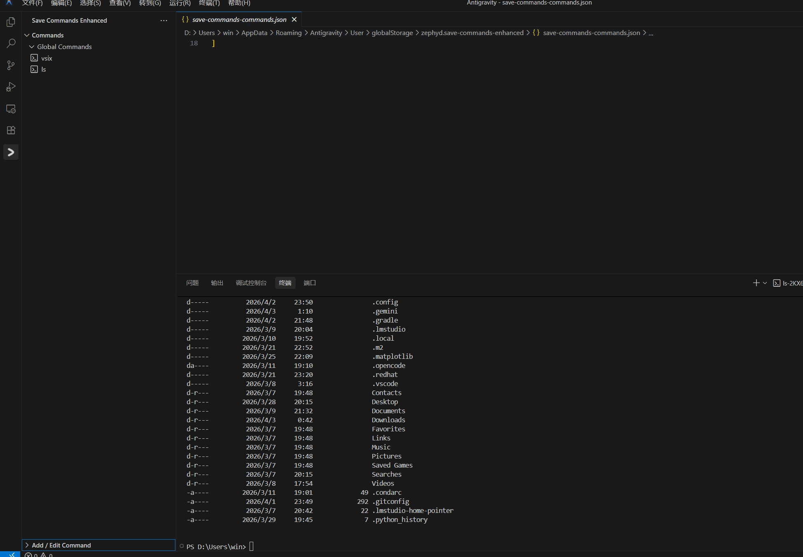

# Save Commands Enhanced

A powerful and elegant VS Code extension to save, organize, and execute terminal commands with a modern, interactive interface.

# Demo



## 🚀 Key Features

- **Interactive Sidebar**: Manage your commands in a beautiful, Gemini-styled sidebar form. No more popups.
- **Multi-line Commands**: Support for complex shell scripts and multi-line sequences with a spacious code editor.
- **Dynamic Parameter Engine**: Inject user input into your commands on-the-fly using the `{{placeholder}}` syntax.
- **Double-Click Workflow**: Clean separation between organization (single-click drag) and editing (double-click to open form).
- **Advanced Drag & Drop**: Effortlessly reorder items or move them into folders. Empty folders are fully supported as drop targets.
- **Unified Scope Management**: Seamlessly manage both Global (machine-wide) and Workspace (project-specific) command sets.

## 🛠️ Usage

### Adding & Editing Commands
1. Click the **+** icon in the sidebar to add a new command.
2. **Double-click** any existing command to edit it instantly.
3. Use the `{ }` helper button in the form footer to wrap selected text into a dynamic parameter.
4. Press **Ctrl + Enter** (or **Cmd + Enter**) to save.

### Terminal Placeholders
You can add placeholders like `{{package_name}}`. When executed, the extension will prompt you for the specific value.
- Use the sidebar form's helper button for quick wrapping.
- Customize the placeholder syntax (e.g., `{{name}}`, `{name}`, `<name>`) in settings.

### Run & Organizational Features
- **Run Folder**: Execute all nested commands in a folder as one sequence. Configure the "Join With" operator (e.g. ` && `, ` ; `) via the folder edit form.
- **Sidebar Icons**: Right-click items for extra actions like Copy to Clipboard or Deletion.

## ⚙️ Configuration (JSON)

Save Commands Enhanced follows a **JSON-first** philosophy. All your commands are stored in simple, readable JSON files that you can manage directly.

- **Open Config**: Right-click on the "Global Commands" or "Workspace Commands" root nodes in the sidebar and select **Open Config (JSON)**.
- **Batch Editing**: Need to reorganize 50 commands? Just open the JSON and use VS Code's powerful multi-cursor editing.
- **Real-time Sync**: Any changes saved to the JSON files are instantly reflected in the sidebar view.
- **Backup**: Simply copy your `commands.json` files to any backup location or version control.

## 🛠️ Development & Testing
Contribution is welcome! You can run the unit test suite locally:
```bash
npm run unit-test
```
*Built with modern TypeScript and a custom VS Code mock environment.*

---
