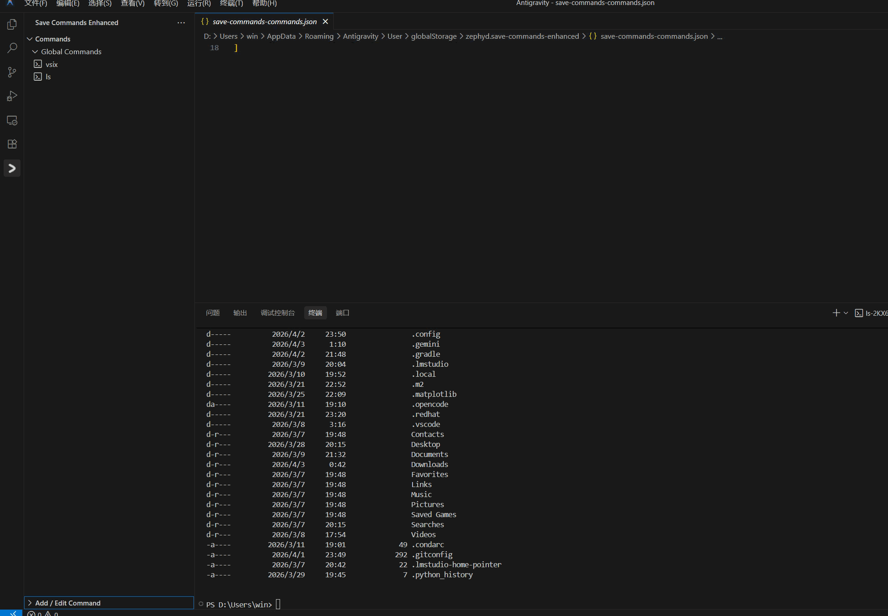

# Save Commands Enhanced

A powerful and elegant VS Code extension to save, organize, and execute terminal commands with a modern, interactive interface, combined with a **Terminal-Synchronized Remote File Explorer** for SSH hosts, Docker containers, and Kubernetes pods.

# Demo



## 🚀 Key Features

- **Split View Sidebar**: Clean separation between **Commands** (scripting and grouping) and **SSH Connections** (host management) panels.
- **Double-Click Edit Workflow**: Single-click to select or drag; double-click any command or SSH connection to slide open the editing panel instantly.
- **Space-Saving Smart Form**: Double-column input fields (Host & Port, Username & Password) designed for narrow sidebars, completely eliminating scrollbars.
- **Full Keyboard Navigation**: Complete forms using `Enter` key focus jumping (`Name` ➔ `Host` ➔ `Port` ➔ `User` ➔ `Pwd` ➔ `Sudo Pwd` ➔ `Save`).
- **Dynamic Auto-Collapse**: The editor panel slides open when needed and automatically collapses/hides upon saving, clearing, or when clicking items elsewhere.
- **Multi-line Commands**: Support for complex shell scripts and multi-line sequences with a spacious code editor.
- **Dynamic Parameter Engine**: Inject user input into your commands on-the-fly using custom dynamic placeholders.
- **Advanced Drag & Drop**: Effortlessly reorder items or move them into folders.
- **Unified Scope Management**: Seamlessly manage both Global (machine-wide) and Workspace (project-specific) configs.
- **Terminal-Synchronized Remote File Explorer**:
  - **Multi-Target Mounting**: Browse files locally, on remote SSH servers (via SFTP/Shell), inside Docker containers, and inside Kubernetes pods.
  - **Root Privilege Escalation**: Full support for optional `sudoPassword` configuration to perform root actions (`stat`, `write`, `rm`, `mkdir`) dynamically.
  - **Live Editing**: Directly edit and save files (`Ctrl+S`) inside containers or remote hosts over pooled SSH channels.
  - **Bi-directional Terminal Sync**: 
    - *Explorer ➔ Terminal*: Open a terminal tab directly inside a remote host/container at the explorer directory.
    - *Terminal ➔ Explorer*: Click sync (`$(sync)`) to align the explorer view to your active shell terminal's working directory.
  - **Clipboard & File Operations**: Recursive copy/paste/cut, drag-and-drop uploads/moves, recursive folder downloads, and batch file/folder uploads.
  - **Manual Connection Fallback**: Skip searching long container/pod lists by choosing manual input to attach directly.

---

## 🛠️ Usage

### Adding & Editing Commands / SSH Connections
1. Click the **+** (Add) icon on root nodes in the **Commands** or **SSH Connections** sidebar to create new entries.
2. **Double-click** any existing command or SSH connection to edit it instantly.
3. In SSH mode, press **Enter** in input boxes to jump to the next field.
4. Press **Ctrl + Enter** (or **Cmd + Enter**) to save.

### Dynamic Parameters & Placeholders (动态参数与占位符)
You can inject dynamic parameters into your saved commands using placeholders (e.g. `{{package_name}}` or `{{version}}`).
- **Execution Prompts**: When executing a command containing placeholders, a native VS Code input box will automatically pop up prompting you for the specific value.
- **Form Helper**: While editing, highlight any text in the command editor and click the `{ }` helper button in the footer to quickly wrap it as a parameter placeholder.
- **Custom Placeholders Syntax**: Change the default regex syntax pattern (e.g. `{{name}}`, `{name}`, `<name>`, `<<name>>`) inside VS Code Settings under: `save-commands.placeholderType`.

### Folder Run Operations (文件夹顺序批处理)
You can group multiple related scripts into folders and execute them sequentially:
- **Batch Run**: Click the **Run Folder** icon next to any folder node to execute all child scripts in sequence within a single terminal session.
- **Operator Options**: Reorder commands inside a folder via drag and drop. By default, scripts are joined by ` && ` (stops sequence if any preceding command returns error). You can customize this join operator (e.g. ` && `, ` ; `, ` || `) inside the folder's edit panel.

### Remote File Explorer Operations
- **Mount SSH**: Click the inline folder icon next to any connection in the SSH Connections list.
- **Attach Container**: Right-click an SSH connection (or use the commands palette) and select **Attach Docker Container...** or **Attach Kubernetes Pod...**.
- **Open Terminal inside Container/Host**: Click the terminal icon (`$(terminal)`) in the Remote File Explorer toolbar to spawn a shell terminal attached directly inside the container/host at the current path.
- **Disconnect**: Click the disconnect icon (`$(debug-disconnect)`) in the Remote File Explorer toolbar to instantly revert back to the local workspace project.

---

## ⚙️ Configuration (JSON)

Save Commands Enhanced follows a **JSON-first** philosophy. All your commands and connections are stored in simple, readable JSON files.

- **Open Config**: Right-click on the "Global Commands/Connections" or "Workspace Commands/Connections" root nodes in the sidebars and select **Open Config (JSON)**.
- **Batch Editing**: Reorganize commands using VS Code's powerful multi-cursor editing.
- **Real-time Sync**: Any changes saved to the JSON files are instantly reflected in the sidebar views.

---

## 🛠️ Development & Testing

Contribution is welcome! You can run the unit test suite locally:
```bash
npm run unit-test
```
*Built with modern TypeScript and a custom VS Code mock environment.*
