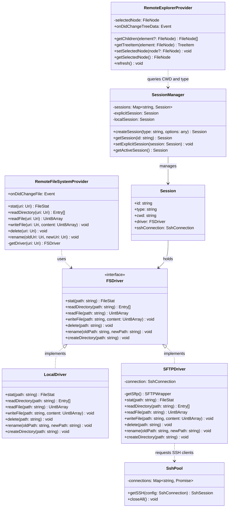

# Remote File Explorer - Phase 2 & 3 Documentation

This document describes the design, features, directory structure, and architecture of the **Terminal-Synchronized Remote File Explorer** with full support for Local/Remote Docker Containers and Kubernetes Pods.

---

## 1. Features (功能特性)

This system establishes a fully functional, terminal-synchronized file browser inside VS Code for browsing and managing files locally, on remote SSH servers (via SFTP), inside Docker containers, and inside Kubernetes pods.

### Core Features:
- **Terminal Synchronization (终端联动)**:
  - **Explorer to Terminal**: Right-click a folder in the Explorer and open a new VS Code terminal that automatically connects to SSH and runs `cd <path>` to match the folder.
  - **Terminal to Explorer**: Press the sync (`$(sync)`) button in the toolbar to capture the active terminal's path (with auto-detection for local terminals and confirmation for remote terminals) and re-focus/refresh the explorer at that path.
- **Direct Browsing**: Browse remote SFTP files immediately by clicking the inline folder icon next to an SSH connection in the Command sidebar—**without** spawning a terminal first.
- **Parent Navigation (返回上一级)**: A toolbar navigation button (`$(arrow-up)`) to jump up one level of the current explorer root directory, unlocking the breadcrumb layout.
- **Real-time Refresh**: A refresh button (`$(refresh)`) to reload the file tree and display files created in external terminal programs.
- **Selection-Aware Syncing**: Linking the sync paths to the currently highlighted item in the explorer view for swift CWD syncing.
- **Virtual FileSystemProvider (`save-commands-remote://`)**:
  - Modify and hit `Ctrl+S` to write changes back to the remote server immediately over the pooled SSH channel.
- **Docker Container Integration (Docker 容器集成)**:
  - Attach to any running Docker container locally or on a remote SSH host.
  - Browse container files, create, rename, delete, copy, paste, and download files directly.
- **Kubernetes Pod Integration (Kubernetes Pod 集成)**:
  - Attach to any Kubernetes pod container locally or on a remote SSH host.
  - Browse pod file structures directly and perform standard file edits and transfers.

### Native Clipboard & File Manipulations:
- **New File / New Folder**: Create blank files or directories directly in the active explorer directory.
- **Rename & Delete**: Standard file management actions with safety confirmation dialogs.
- **Clipboard Actions (Cut, Copy, Paste)**:
  - Copy and Cut files/directories.
  - Paste files/folders recursively (folder copy recreates all child folders and files recursively on the destination directory).
- **Copy Path & Copy Relative Path**: Swiftly write remote absolute or relative paths to your system clipboard.
- **File Downloads**: Download any remote file or directory recursively to your local PC with a native directory chooser and VS Code progress notification.
- **File Uploads**: Right-click to upload files ("Upload Files...") or folders ("Upload Folder...") recursively to the active remote folder.
- **Drag-and-Drop Integration**:
  - Drag remote files/directories to another remote folder to move them.
  - Drag remote files to the editor zone to open them.
  - Drag local files from your OS Desktop/Explorer (or VS Code's native Local Explorer) and drop them onto the Remote Explorer to upload them recursively.

---

## 2. Directory Structure (文件目录结构)

Below is the directory layout of all files introduced and modified during Phase 1:

```text
vscode-save-commands/
├── doc/
│   └── remote_explorer.md                 <-- [NEW] This documentation file
├── package.json                           <-- [MODIFIED] Registers commands, views, and menus
├── tsconfig.json                          <-- [MODIFIED] Excludes reference SFTP workspace
├── build/
│   └── node-extension.webpack.config.js   <-- [MODIFIED] Configures ssh2 as external dependency
└── src/
    ├── extension.ts                       <-- [MODIFIED] Registers providers and listener hooks
    ├── explorer/                          <-- [NEW] Explorer foundations
    │   ├── sshPool.ts                     <-- SSH connection pool & session cache manager
    │   ├── session.ts                     <-- Active sessions mapped to terminal sessions
    │   ├── remoteFileSystemProvider.ts    <-- vscode.FileSystemProvider for virtual paths
    │   ├── remoteExplorerProvider.ts      <-- vscode.TreeDataProvider for Remote Explorer
    │   └── drivers/                       <-- Virtual filesystem drivers
    │       ├── fsDriver.ts                <-- FSDriver interface
    │       ├── localDriver.ts             <-- Local OS driver implementation
    │       ├── sftpDriver.ts              <-- Stateless remote SFTP driver implementation
    │       ├── dockerDriver.ts            <-- [NEW] Docker container filesystem driver
    │       ├── k8sDriver.ts               <-- [NEW] Kubernetes pod filesystem driver
    │       └── driverUtils.ts             <-- [NEW] Command execution stream helpers
    └── functions/                         <-- Core command executions
        ├── index.ts                       <-- [MODIFIED] Module exports aggregation
        ├── sshConnect.ts                  <-- [MODIFIED] Links spawned SSH terminals to sessions
        └── remote/                        <-- [NEW] Remote explorer interactive commands
            ├── addSshConnection.ts
            ├── editSshConnection.ts
            ├── deleteSshConnection.ts
            ├── sshConnectInActiveTerminal.ts
            ├── browseRemoteFiles.ts
            ├── openTerminalAtRemoteDir.ts
            ├── syncExplorerToTerminal.ts
            ├── remoteNewFile.ts
            ├── remoteNewFolder.ts
            ├── remoteRename.ts
            ├── remoteDelete.ts
            ├── remoteCopy.ts
            ├── remoteCut.ts
            ├── remotePaste.ts
            ├── remoteCopyPath.ts
            ├── remoteCopyRelativePath.ts
            ├── remoteDownload.ts
            ├── remoteUpload.ts            <-- Parametrized file/folder upload handler
            ├── attachDocker.ts            <-- [NEW] Lists and attaches to Docker containers
            └── attachK8s.ts               <-- [NEW] Lists and attaches to Kubernetes Pods
```

---

## 3. Architecture & Class Diagram (架构与类图)

The architecture splits operations into stateless filesystem drivers (`FSDriver`), a central stateful session registry (`sessionManager`), a shared connection manager (`sshPool`), and the visual interface layer (`RemoteExplorerProvider`).

### Class Diagram:



### Key Architectural Patterns:
1. **Delegation / Strategy Pattern**: The `RemoteFileSystemProvider` delegates file system activities to the active `Session`'s driver, enabling easy switching between `Local`, `SFTP`, and future `Docker`/`Kubernetes` environments.
2. **Flyweight / Connection Pooling**: `SshPool` caches connection instances to avoid the severe latency and overhead of re-authenticating and spawning SSH processes on every single file read/write.
3. **Decoupled Event Handling**: `remoteExplorerProvider.refresh()` allows user interface nodes to remain simple, forcing tree reload on command execution.
