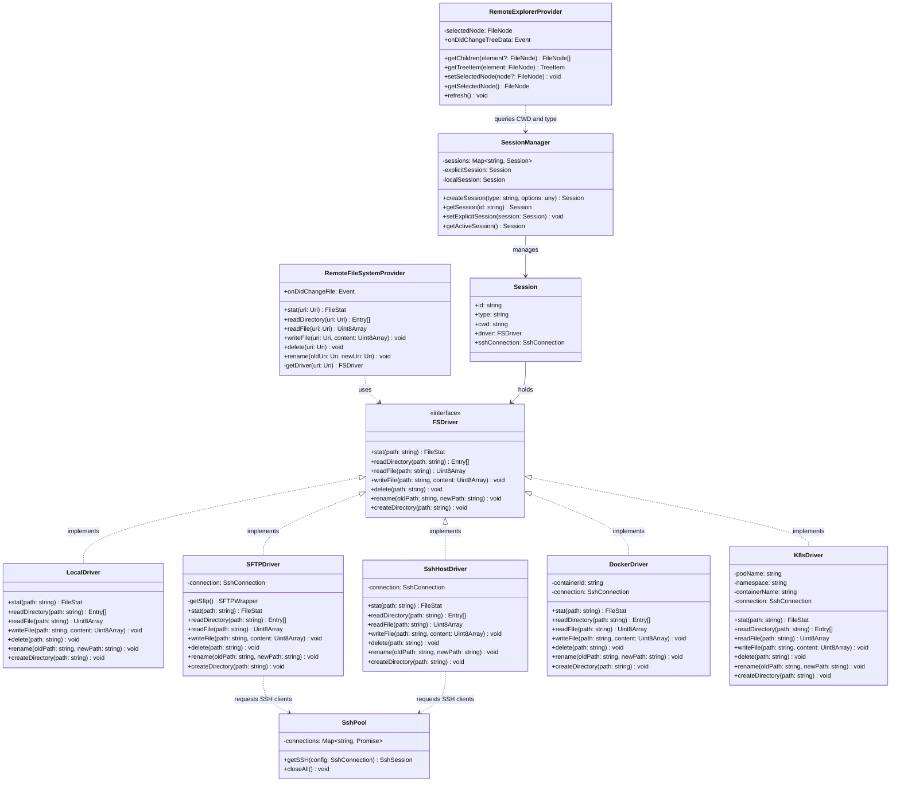

# Terminal-Synchronized Remote File Explorer

This document describes the design, features, directory structure, and architecture of the **Terminal-Synchronized Remote File Explorer** with full support for Local/Remote Docker Containers and Kubernetes Pods.

---

## 1. Features (功能特性)

This system establishes a fully functional, terminal-synchronized file browser inside VS Code for browsing and managing files locally, on remote SSH servers (via SFTP/Shell), inside Docker containers, and inside Kubernetes pods.

### Core Features:
- **Dedicated Sidebar Views (独立的侧边栏视图)**:
  - **Commands View**: Displays global and workspace command scripts.
  - **SSH Connections View**: A separate, focused panel containing only global and workspace SSH connections, keeping scripting independent of connection management.
- **Double-Click Edit Shortcuts (双击快捷编辑)**:
  - Double-click any command or SSH connection node to instantly slide open the Add/Edit form webview with data pre-filled.
- **Space-Saving Form Layout (紧凑型输入面板)**:
  - Compressed form styling grouping fields (e.g., Host & Port, Username & Password) on a single row, minimizing vertical space and completely eliminating the need for sidebar scrollbars.
- **Enter Key Focus Flow (回车键智能跳转)**:
  - Complete forms via keyboard only. Pressing `Enter` automatically shifts focus: `Name` ➔ `Host` ➔ `Port` ➔ `User` ➔ `Pwd` ➔ `Sudo Pwd` ➔ `Submit`.
- **Dynamic Auto-Collapse/Hide (按需滑出折叠)**:
  - The Add/Edit panel remains hidden by default. It opens instantly upon editing or adding, and automatically collapses/hides upon saving, clearing, or when clicking items anywhere else in the tree views.
- **Project Folder Defaulting (本地默认直达工作区)**:
  - When no remote session is active, the Remote File Explorer defaults to displaying the active VS Code workspace root directory instead of the user home folder.
- **One-Click Disconnect (一键断开连接)**:
  - A dynamic disconnect button (`$(debug-disconnect)`) appears on the file explorer title menu when a remote session is active, allowing quick reversion to the local workspace folder.
- **Docker & K8s Terminal Integration (容器内一键唤醒终端)**:
  - Click the "Open Terminal Here" icon (`$(terminal)`) in a Docker or Kubernetes session to automatically spawn a terminal and connect:
    - **Docker**: Launches `docker exec -w "<path>" -it <container> sh` (automatically prepends `sudo` if host `sudoPassword` is configured).
    - **Kubernetes**: Launches `kubectl exec -it <pod> -n <namespace> -c <container> -- sh -c "cd '<path>' && exec sh"`.
- **Manual Input Fallback for Containers (容器选择备用输入)**:
  - QuickPick lists for Docker and K8s contain a manual fallback choice (`$(pencil) Enter manually...`). If container/pod retrieval fails or lists are too large, users can skip search and type names directly.
- **Virtual FileSystemProvider (`save-commands-remote://`)**:
  - Modify and hit `Ctrl+S` to write changes back to the remote server immediately over the pooled SSH channel.

### Native Clipboard & File Manipulations:
- **New File / New Folder**: Create blank files or directories directly in the active explorer directory.
- **Rename & Delete**: Standard file management actions with safety confirmation dialogs.
- **Clipboard Actions (Cut, Copy, Paste)**:
  - Copy and Cut files/directories.
  - Paste files/folders recursively (folder copy recreates all child folders and files recursively on the destination directory).
- **Copy Path & Copy Relative Path**: Swiftly write remote absolute or relative paths to your system clipboard.
- **File Downloads**: Download any remote file or directory recursively to your local PC with a native directory chooser and VS Code progress notification.
- **File Uploads**: Right-click to upload files ("Upload Files...") or folders ("Upload Folder...") recursively to the active remote folder.
- **Drag-and-Drop Integration**:
  - Drag remote files/directories to another remote folder to move them.
  - Drag remote files to the editor zone to open them.
  - Drag local files from your OS Desktop/Explorer and drop them onto the Remote Explorer to upload them recursively.

---

## 2. Directory Structure (文件目录结构)

Below is the directory layout of all files introduced and modified:

```text
vscode-save-commands/
├── doc/
│   └── remote_explorer.md                 <-- This documentation file
├── package.json                           <-- Registers commands, views, and menus
├── tsconfig.json                          <-- Configures typescript build exclusions
├── build/
│   └── node-extension.webpack.config.js   <-- Configures webpack bundling and dependencies
└── src/
    ├── extension.ts                       <-- Registers view providers and event listener hooks
    ├── TreeProvider.ts                    <-- Manages Commands & SSH data tree logic
    ├── TreeItem.ts                        <-- Tree node model mapping icons and double-click actions
    ├── FormViewProvider.ts                <-- HTML rendering and input logic for Add/Edit panel
    ├── explorer/                          <-- Explorer foundations
    │   ├── sshPool.ts                     <-- SSH connection pool & session cache manager
    │   ├── session.ts                     <-- Active sessions mapped to terminal sessions
    │   ├── remoteFileSystemProvider.ts    <-- vscode.FileSystemProvider for virtual paths
    │   ├── remoteExplorerProvider.ts      <-- vscode.TreeDataProvider for Remote Explorer
    │   └── drivers/                       <-- Virtual filesystem drivers
    │       ├── fsDriver.ts                <-- FSDriver interface
    │       ├── localDriver.ts             <-- Local OS driver implementation
    │       ├── sftpDriver.ts              <-- Stateless remote SFTP driver implementation
    │       ├── sshHostDriver.ts           <-- Host shell driver for commands run under root/sudo
    │       ├── dockerDriver.ts            <-- Docker container filesystem driver
    │       ├── k8sDriver.ts               <-- Kubernetes pod filesystem driver
    │       └── driverUtils.ts             <-- Command execution stream helpers
    └── functions/                         <-- Core command executions
        ├── index.ts                       <-- Module exports aggregation
        ├── sshConnect.ts                  <-- Links spawned SSH terminals to sessions
        └── remote/                        <-- Remote explorer interactive commands
            ├── addSshConnection.ts
            ├── editSshConnection.ts
            ├── deleteSshConnection.ts
            ├── sshConnectInActiveTerminal.ts
            ├── browseRemoteFiles.ts
            ├── openTerminalAtRemoteDir.ts
            ├── syncExplorerToTerminal.ts
            ├── remoteNewFile.ts
            ├── remoteNewFolder.ts
            ├── remoteRename.ts
            ├── remoteDelete.ts
            ├── remoteCopy.ts
            ├── remoteCut.ts
            ├── remotePaste.ts
            ├── remoteCopyPath.ts
            ├── remoteCopyRelativePath.ts
            ├── remoteDownload.ts
            ├── remoteUpload.ts
            ├── attachDocker.ts            <-- Lists and attaches to Docker containers
            └── attachK8s.ts               <-- Lists and attaches to Kubernetes Pods
```

---

## 3. Architecture & Class Diagram (架构与类图)

The architecture splits operations into stateless filesystem drivers (`FSDriver`), a central stateful session registry (`sessionManager`), a shared connection manager (`sshPool`), and the visual interface layer (`RemoteExplorerProvider`).

### Class Diagram:



### Key Architectural Patterns:
1. **Delegation / Strategy Pattern**: The `RemoteFileSystemProvider` delegates file system activities to the active `Session`'s driver, enabling easy switching between `Local`, `SFTP`, `SshHost`, `Docker`, and `K8s` environments.
2. **Sudo Privilege Management**: When initializing an SSH session with a configured `sudoPassword`, the system dynamically hot-swaps `SFTPDriver` with `SshHostDriver` to pipe all file reads, writes, deletions, and folder creations through nested `sudo -S sh -c '<command>'` shells.
3. **Flyweight / Connection Pooling**: `SshPool` caches connection instances to avoid severe latency and overhead of re-authenticating and spawning SSH processes on every single file read/write.
4. **Decoupled Event Handling**: `remoteExplorerProvider.refresh()` allows user interface nodes to remain simple, forcing tree reload on command execution.

---

## 4. Technical Implementation Details (实现细节)

### 1) SSH Sudo Exec Command Wrapping & Input Stream Feeding
To perform host file operations requiring root access (e.g. creating files in root-restricted directories), commands are run through a virtual host shell wrapper.
* **Escaping Shell Characters**: Remote command arguments are wrapped inside single quotes. The query string replaces any single quote characters with escaped single quotes (`cmd.replace(/'/g, "'\\''")`) to prevent command injection and variables expansion on the remote shell.
* **Command Wrapping**: The final wrapped shell command format is:
  ```bash
  sudo -S sh -c '<escaped_command>'
  ```
* **Stdin Feedback Loop**: When the `ssh2` stream is opened, the `sudoPassword` (followed by a newline `\n`) is written immediately into the stream's stdin buffer. This satisfies the `sudo -S` password prompt.
* **Stderr Stream Scrubbing**: A custom buffer interceptor filters out standard terminal prompts (e.g., `[sudo] password for ...`) from the SSH stderr stream. This ensures error message indicators do not cause false-positive error alerts in VS Code.

### 2) Driver Selection and Hot-Swapping Lifecycle
A stateful router handles filesystem drivers in `session.ts`:
* When an SSH connection is mounted, the plugin checks if `sshConnection.sudoPassword` is defined.
* If **present**, it instantiates and registers `SshHostDriver`. All filesystem operations (like `stat`, `mkdir`, `rm`) are delegated to remote shell commands (`test -d`, `mkdir -p`, `rm -rf`) executed under root.
* If **absent**, it defaults to the standard stateless `SFTPDriver` to perform native SFTP operations directly.

### 3) Resilient Container Path Stat Checks
Within Docker and Kubernetes drivers, standard stat checks (`stat` commands) are not always available on minimalistic container images (e.g., Alpine or Distroless).
* Instead of running nested complex command pipelines, the drivers perform direct POSIX existence tests:
  ```bash
  test -d '<path>' && echo 'd' || (test -f '<path>' && echo 'f' || echo 'none')
  ```
* Output results are parsed and mapped to either a directory type, a file type, or mapped directly to a VS Code standard `vscode.FileSystemError.FileNotFound()` error in `remoteFileSystemProvider.ts`. This triggers the native workspace folder creator workflow seamlessly.

### 4) View Focus Reset and Event Listeners
To keep the layout clean, the Add/Edit form's visibility changes dynamically:
* The `save-commands-form-view` visibility menu is bound to the VS Code context key `save-commands.form-active`.
* The state is flipped to `true` when user double-clicks items or hits adding buttons, drawing focus to the form.
* The state is flipped to `false` when form submits or when any tree selection event triggers (`onDidChangeSelection` on the Commands tree, SSH tree, or Remote Explorer tree), causing the form view to instantly disappear.

### 5) Container Attachment & Streaming Connection Pipelines (容器挂载与流式连接通道)
Docker and Kubernetes mounts are established dynamically through stateless command streams, supporting both local loopback hosts and remote SSH target hosts.

#### A. Docker Container Pipeline:
1. **Container Listing**:
   * Runs `docker ps --format "{{.ID}}\t{{.Names}}\t{{.Image}}\t{{.Status}}"` to retrieve active containers.
   * If an SSH connection (`conn`) is bound to the mounting action, the command is executed remotely over the pooled SSH client using `execSsh(session.client, cmd)`. Otherwise, it runs locally using `execLocal(cmd)`.
2. **File Stream Operations (`dockerDriver.ts`)**:
   * **Reading Files**: Launches `docker exec -i <containerId> cat '<path>'` and pipes the output stream back to the VS Code filesystem reader.
   * **Writing Files**: Launches `docker exec -i <containerId> sh -c "cat > '<path>'"` and pipes the modified content directly into the stdin stream.
   * **Directories Listing**: Executes `docker exec -i <containerId> ls -1ap '<path>'` and parses the line-by-line output entries to distinguish files and nested sub-folders.
   * **Root Actions (Sudo)**: If `sudoPassword` is provided in the target connection settings, commands are prepended with `sudo -S` and the password is automatically written into the stdin pipeline prior to execution.

#### B. Kubernetes Pod Pipeline:
1. **Pod Listing**:
   * Runs a command query:
     ```bash
     kubectl get pods -A -o jsonpath='{range .items[*]}{.metadata.namespace}{"\t"}{.metadata.name}{"\t"}{range .spec.containers[*]}{.name}{","}{end}{"\n"}{end}'
     ```
     This retrieves the namespace, pod name, and all sub-container names. If over SSH, it is executed via the `execSsh` pool.
2. **File Stream Operations (`k8sDriver.ts`)**:
   * **Reading Files**: Runs `kubectl exec -i <podName> -n <namespace> -c <containerName> -- cat '<path>'` to dump the file contents into the output buffer.
   * **Writing Files**: Runs `kubectl exec -i <podName> -n <namespace> -c <containerName> -- sh -c "cat > '<path>'"` and streams VS Code's save content directly into the stdin buffer.
   * **Directories Listing**: Runs `kubectl exec -i <podName> -n <namespace> -c <containerName> -- ls -1ap '<path>'` to retrieve and catalog elements.
